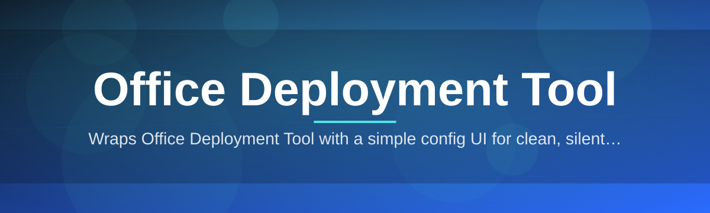

# office-deploy-manager

Wraps Office Deployment Tool with a simple config UI for clean, silent installs

  

## Overview

Wraps Office Deployment Tool with a simple config UI for clean, silent installs

## License

[MIT License](LICENSE)
